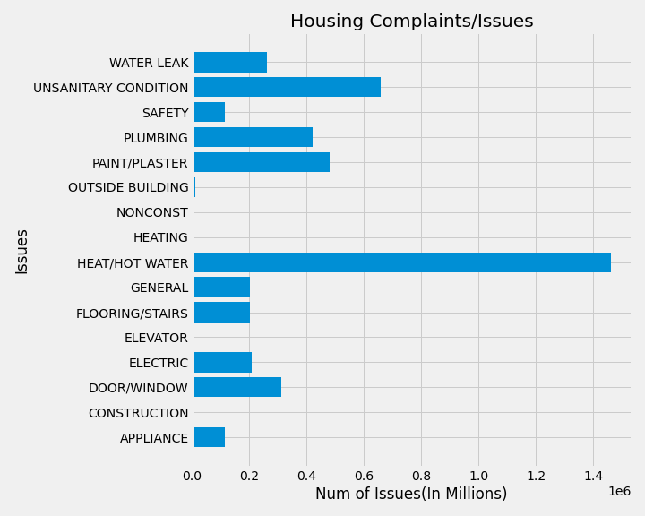

# Overview
  For this project, I wanted to look at how public infrastructures and buildings were being maintained and how fast problems were resolved when issues occurred. As New Yorkers, we live within these apartments/housings and use public infrastructures, whether they may be public transportations or public spaces. Whenever there’s a problem within one’s house or within a public infrastructure, it should be reported and fixed as soon as possible so that people’s lives aren’t affected due to these issues. By finding areas within NYC that are hit the most, we can get more people to go to these areas and help renovate. In order to explore, I looked at building and housing complaints and complaints on NYC landmarks to see where these complaints and issues lie as well to see what the most common issues were. Using libraries such as pandas, pandasql, numpy and matplotlib, I was able to explore the data and display my results. 

# Data 
  Below shows the number of complaints on landmarks within NYC orgnaized by Borough and the status of the complaint: Closed as the issue is resolved or Open as the issue is still not resolved. The table displays the distribution and the graph is the visualization of my table's result. 

|        | Borough | Status | num_status |
|--------|---------|--------|------------|
0        |  bronx  | Closed |     117    |
1        |  bronx  |  Open  |     20     |
2        |brooklyn | Closed |     1237   |
3        |brooklyn |  Open  |     120    |
4        |manhattan| Closed |     1697   |
5        |manhattan|  Open  |     216    |
6        |queens   | Closed |     423    |
7        |queens   |  Open  |     51     |
8        |staten island|  Closed |          42 |
9        |staten island|    Open |          5  |

  Below shows the number of complaints on housing maintanence code within NYC orgnaized by Borough and the status of the complaint: Closed as the issue is resolved or Open as the issue is still not resolved. The table displays the distribution and the graph is the visualization of my table's result. 

|        | Borough | Status | num_status |
|--------|---------|--------|------------|
0        |  bronx  | close  |   803775   |
1        |  bronx  | open   |    4560    |
2        |brooklyn | close  |   796933   |
3        |brooklyn |  open  |    4664    |
4        |manhattan| close  |   560125   |
5        |manhattan|  open  |    4866    |
6        |queens   |  close |   326827   |
7        |queens   |  open  |    1496    |
8        |staten island|  close |       36383 |
9        |staten island |  open |       344 |

  Below shows the different issues that occur within an apartment/housing complex. The table displays the number of occurrences that each issue has occurred and graphed the table's results.

|        | MajorCategory   |   num  |
|--------|------------------|------------|
0        |      APPLIANCE  | 116360 |
1        |   CONSTRUCTION  |    11 |
2        |    DOOR/WINDOW  | 313380 |
3        |       ELECTRIC  |  208528 |
4        |       ELEVATOR  |  10005  |
5        |FLOORING/STAIRS  | 203034  |
6        |        GENERAL  | 202734  |
7        | HEAT/HOT WATER  | 1460305 |
8        |        HEATING  |   3600  |
9        |       NONCONST  |    419  |
10       |OUTSIDE BUILDING |   12952 |
11       |  PAINT/PLASTER  | 479786  |
12       |       PLUMBING  | 420629  |
13       |         SAFETY |  114825  |
14       |UNSANITARY CONDITION |  658234 |
15       |     WATER LEAK |  261476     |

# Techniques 
  Using pandas, I read each csv file taken from the NYC public data. The Complaint Problems file had some lines that were not able to be read so they were dropped when read. After creating our dataframe from the read file, I used pandasql to write queries to aggregate the data: GROUPING columns and COUNTING rows. With the help of geeksforgeeks, I plotted the aggregated information using matplotlib. 

# Citations 
Links to Data Sources:
- [https://data.cityofnewyork.us/Housing-Development/Landmarks-Complaints/ck4n-5h6x](https://data.cityofnewyork.us/Housing-Development/Landmarks-Complaints/ck4n-5h6x)
- [https://data.cityofnewyork.us/Housing-Development/Housing-Maintenance-Code-Complaints/uwyv-629c](https://data.cityofnewyork.us/Housing-Development/Housing-Maintenance-Code-Complaints/uwyv-629c)
- [https://data.cityofnewyork.us/Housing-Development/Complaint-Problems/a2nx-4u46](https://data.cityofnewyork.us/Housing-Development/Complaint-Problems/a2nx-4u46)
