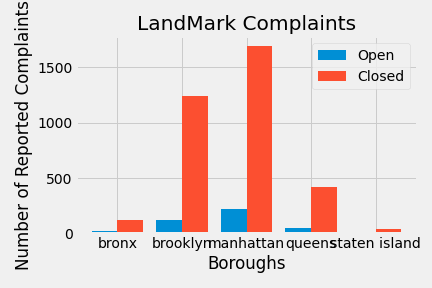
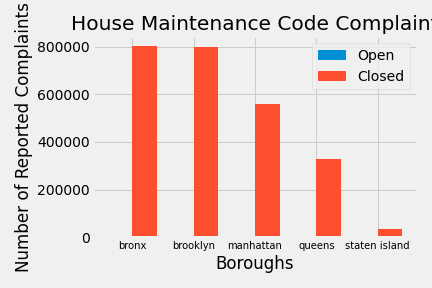

# Analysis

|        | Borough | Status | num_status |
|--------|---------|--------|------------|
0        |  bronx  | Closed |     117    |
1        |  bronx  |  Open  |     20     |
2        |brooklyn | Closed |     1237   |
3        |brooklyn |  Open  |     120    |
4        |manhattan| Closed |     1697   |
5        |manhattan|  Open  |     216    |
6        |queens   | Closed |     423    |
7        |queens   |  Open  |     51     |
8        |staten island|  Closed |          42 |
9        |staten island|    Open |          5  |

|        | Borough | Status | num_status |
|--------|---------|--------|------------|
0        |  bronx  | close  |   803775   |
1        |  bronx  | open   |    4560    |
2        |brooklyn | close  |   796933   |
3        |brooklyn |  open  |    4664    |
4        |manhattan| close  |   560125   |
5        |manhattan|  open  |    4866    |
6        |queens   |  close |   326827   |
7        |queens   |  open  |    1496    |
8        |staten island|  close |       36383 |
9        |staten island |  open |       344 |

