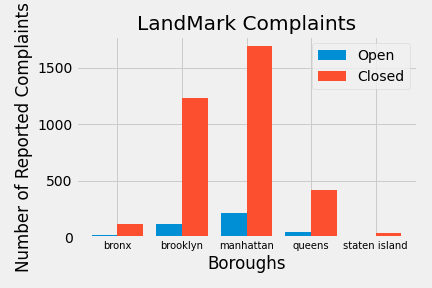

# Overview

# Data 

|        | Borough | Status | num_status |
|--------|---------|--------|------------|
0        |  bronx  | Closed |     117    |
1        |  bronx  |  Open  |     20     |
2        |brooklyn | Closed |     1237   |
3        |brooklyn |  Open  |     120    |
4        |manhattan| Closed |     1697   |
5        |manhattan|  Open  |     216    |
6        |queens   | Closed |     423    |
7        |queens   |  Open  |     51     |
8        |staten island|  Closed |          42 |
9        |staten island|    Open |          5  |

|        | Borough | Status | num_status |
|--------|---------|--------|------------|
0        |  bronx  | close  |   803775   |
1        |  bronx  | open   |    4560    |
2        |brooklyn | close  |   796933   |
3        |brooklyn |  open  |    4664    |
4        |manhattan| close  |   560125   |
5        |manhattan|  open  |    4866    |
6        |queens   |  close |   326827   |
7        |queens   |  open  |    1496    |
8        |staten island|  close |       36383 |
9        |staten island |  open |       344 |

|        | MajorCategory   |   num  |
|--------|------------------|------------|
0        |      APPLIANCE  | 116360 |
1        |   CONSTRUCTION  |    11 |
2        |    DOOR/WINDOW  | 313380 |
3        |       ELECTRIC  |  208528 |
4        |       ELEVATOR  |  10005  |
5        |FLOORING/STAIRS  | 203034  |
6        |        GENERAL  | 202734  |
7        | HEAT/HOT WATER  | 1460305 |
8        |        HEATING  |   3600  |
9        |       NONCONST  |    419  |
10       |OUTSIDE BUILDING |   12952 |
11       |  PAINT/PLASTER  | 479786  |
12       |       PLUMBING  | 420629  |
13       |         SAFETY |  114825  |
14       |UNSANITARY CONDITION |  658234 |
15       |     WATER LEAK |  261476     |

# Techniques 

# Citations 
Links to Data Sources:
- [https://data.cityofnewyork.us/Housing-Development/Landmarks-Complaints/ck4n-5h6x](https://data.cityofnewyork.us/Housing-Development/Landmarks-Complaints/ck4n-5h6x)
- [https://data.cityofnewyork.us/Housing-Development/Housing-Maintenance-Code-Complaints/uwyv-629c](https://data.cityofnewyork.us/Housing-Development/Housing-Maintenance-Code-Complaints/uwyv-629c)
- [https://data.cityofnewyork.us/Housing-Development/Complaint-Problems/a2nx-4u46](https://data.cityofnewyork.us/Housing-Development/Complaint-Problems/a2nx-4u46)
